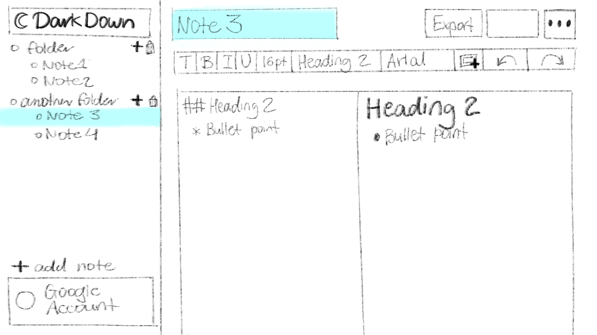
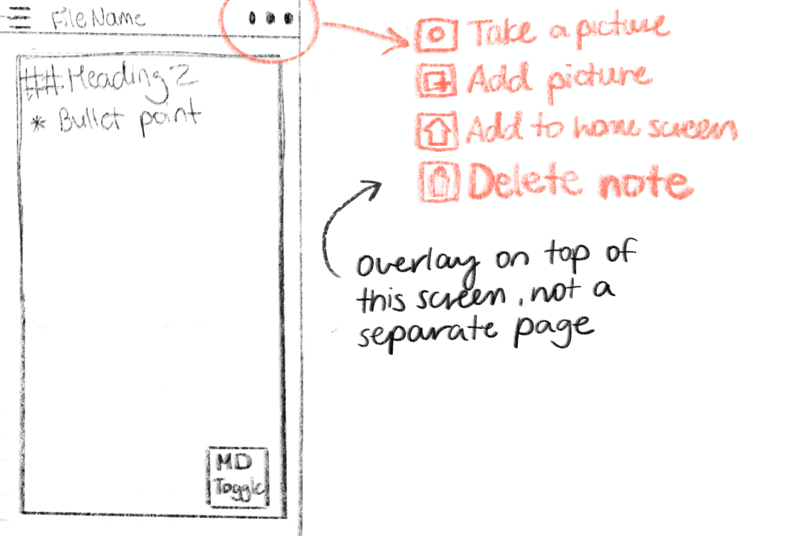
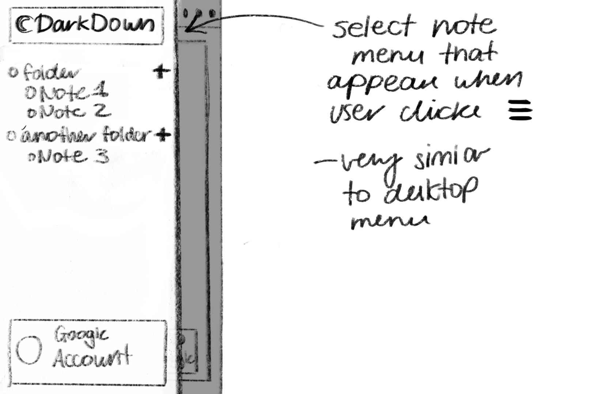

# Module 2 Group Assignment

CSCI 5117, Spring 2022, [assignment description](https://canvas.umn.edu/courses/291031/pages/project-2)

## App Info:

* Team Name: Oysters
* App Name: Darkdown
* App Link: <https://darkdown-44b5e.web.app/>

### Students

* Ace Kaung, kaung006@umn.edu
* David Nguyen, nguy3482@umn.edu
* Julia Pan, pan00079@umn.edu
* Ishan Joshi, joshi304@umn.edu
* Sai Tallapragada, talla037@umn.edu

## Key Features

**Describe the most challenging features you implemented
(one sentence per bullet, maximum 4 bullets):**

* Our Print View feature was intially a PDF export feature, but we reworked it after facing issues with CORS and dynamic styling.
* Linking images to Firestorage and programmatically removing them involved making custom builds of our CKEditor and hand writing plugins.
* Making the sidebar hide on mobile and appear as a pop-up was challenging, especially with 
ignoring events on our editor in favor of the sidebar.
* The live firebase updates in the folder system and documents was harder to do without the help of Vuefire.

Which (if any) device integration(s) does your app support?

* You can take pictures with your phone and upload them.

Which (if any) progressive web app feature(s) does your app support?

* The app can be installed and added to mobile and desktop.

## Mockup images

**[Add images/photos that show your mockup](https://stackoverflow.com/questions/10189356/how-to-add-screenshot-to-readmes-in-github-repository) along with a very brief caption:**

* Both pages will have a very simple login screen with name of the website and "login" button. 

### Desktop Sketch

* Desktop layout for our website. Left part is the note and folder selection, with the ability to add more notes. Right half of the screen is taken by the 2-pane markdown section for note taking. This will also have some of the basic text-editing tools (font, font size, etc) along with buttons for functions we want to implement (export note, delete note, etc). 

### Mobile Sketches

* First image is mobile layout for our website. It only has a single panel for entering text (which supports markdown), a button to toggle between markdown and formatter view, and two navigation buttons at the top: one for settings, and one for accessing other notes. Button for settings will open an overlay with the 4 features outline in the image.
* Second image is the mobile layout when user is trying to access other notes. The main mobile screen darkens, and user has the note and folder selection, very similar to the one for desktop. Tapping on the darkened main section will close that menu. 

## Testing Notes

**Is there anything special we need to know in order to effectively test your app? (optional):**

* This was made in Vue 3.

## Screenshots of Site (complete)

**[Add a screenshot of each key page](https://stackoverflow.com/questions/10189356/how-to-add-screenshot-to-readmes-in-github-repository)
along with a very brief caption:**

The editor view when you have no documents selected.

The view of a single document.

The 404 page.

A view of how you can add folders.

## External Dependencies

**Document integrations with 3rd Party code or services here.
Please do not document required libraries (e.g., Vue, Vuefire, Firebase).**

* Library or service name: description of use
* [CKEditor 5](https://ckeditor.com/ckeditor-5/) - A WYSIWYG Text Editor library
* [Tailwind CSS](https://tailwindcss.com)

**If there's anything else you would like to disclose about how your project
relied on external code, expertise, or anything else, please disclose that
here:**

...
